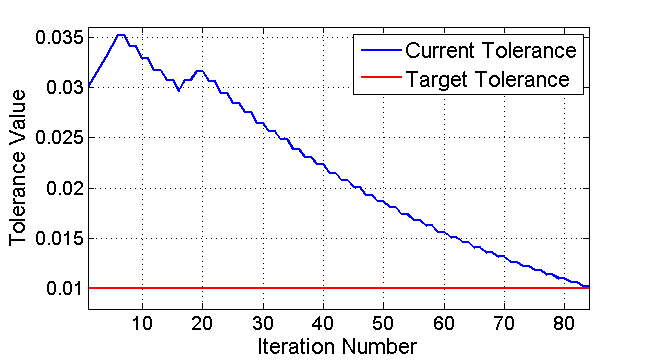

# CarND-Controls-PID
Self-Driving Car Engineer Nanodegree Program

---

## Dependencies

* cmake >= 3.5
 * All OSes: [click here for installation instructions](https://cmake.org/install/)
* make >= 4.1
  * Linux: make is installed by default on most Linux distros
  * Mac: [install Xcode command line tools to get make](https://developer.apple.com/xcode/features/)
  * Windows: [Click here for installation instructions](http://gnuwin32.sourceforge.net/packages/make.htm)
* gcc/g++ >= 5.4
  * Linux: gcc / g++ is installed by default on most Linux distros
  * Mac: same deal as make - [install Xcode command line tools]((https://developer.apple.com/xcode/features/)
  * Windows: recommend using [MinGW](http://www.mingw.org/)
* [uWebSockets](https://github.com/uWebSockets/uWebSockets)
  * Run either `./install-mac.sh` or `./install-ubuntu.sh`.
  * If you install from source, checkout to commit `e94b6e1`, i.e.
    ```
    git clone https://github.com/uWebSockets/uWebSockets 
    cd uWebSockets
    git checkout e94b6e1
    ```
    Some function signatures have changed in v0.14.x. See [this PR](https://github.com/udacity/CarND-MPC-Project/pull/3) for more details.
* Simulator. You can download these from the [project intro page](https://github.com/udacity/self-driving-car-sim/releases) in the classroom.

There's an experimental patch for windows in this [PR](https://github.com/udacity/CarND-PID-Control-Project/pull/3)

## Basic Build Instructions

1. Clone this repo.
2. Make a build directory: `mkdir build && cd build`
3. Compile: `cmake .. && make`
4. Run it: `./pid`. 

## [Rubric](https://review.udacity.com/#!/rubrics/824/view)

### Maunaully tunning

The P.I.D parameters are first chosen by hand. I first try "`Kp=0.4; Ki=0; Kd=2`" and found that it had many wiggling effects. This is because the large `Kp` coefficient makes **overshooting.** Then I reduced the `Kp` value and set `Kp=0.2` as the manual result.

In addition, I found that it is hard to tune `Ki` because the *integral error* is typically larger than *proportional error* in hundreds of magnitude. So I just set it to zero and left it be tuned by twiddling function.

### Twiddle

In order to evaluate each "`Kp,Ki,Kd`" setting, we need to **restart** the simulator. By sending `"42[\"reset\",{}]"` to WebSocket, simulator is able to restart. The twiddling function can then test the performance of each setting and found the best results.

>Each perforamnce evaluation is tested in time stamps 3000 (`#define TWIDDLE_TIME_NUM 3000` in program), which is about 59 seconds. Then twiddling function will update the parameters and restart simulator.

The initial setting is found by manually tunning: "`Kp=0.4; Ki=0; Kd=2`", and I set the initial step size as:
```c++
twiddle_step_size[0] = 0.01; // pd[0] in course lecture
twiddle_step_size[1] = 0.0001; // pd[1] in course lecture
twiddle_step_size[2] = 0.01; // pd[2] in course lecture
```

Moreover, the tolerance, `tol`, is set to `0.01`, and if "`cur_tol<tol`", the twiddling function converges.
One thing that is different from the course is the calculation of `cur_tol`. Instead of using `sum(pd)` as in the course lecture, I used:
```c++
double cur_tol = twiddle_step_size[0]+twiddle_step_size[1]*100+twiddle_step_size[2];
```
I scaled 100 times of `twiddle_step_size[1]` (`pd[1]`). This is because the *integral error* is typically larger than *proportional error* in hundreds of magnitude.

As we can see in the following figure, `cur_tol` converges toward `tol` in the 84th iteration. (about 84 mins)


### Results

The 84th iteration got the following results:

```c++
double Init_Kp = 0.211;
double Init_Ki = 0.0003189;
double Init_Kd = 2.00109;
```
It can successfully drive a lap around the track!
